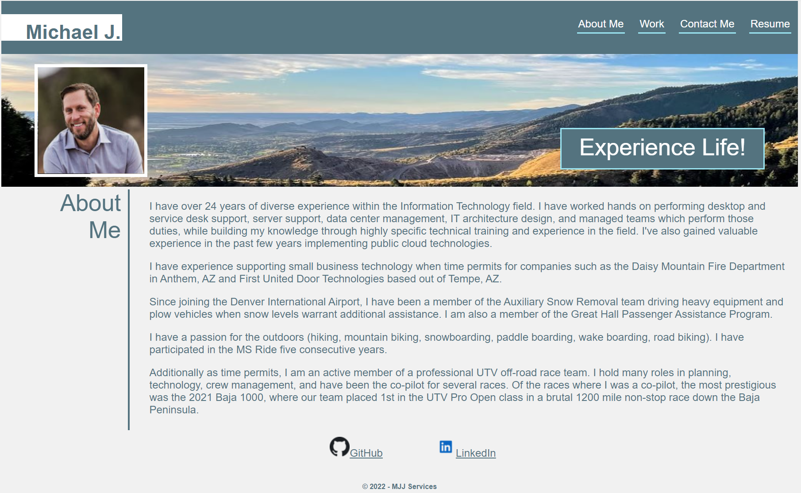

# DU-React-Portfolio

DU Coding Bootcamp: Portfolio

# Website

This is a website showcasing **Michael J.** experience and work.

Public Website Address: 

## Purpose

This website is specific to anyone seeking information on the experience, work examples, and contact info for Michael J.

## Audience

The intended audience is an individual (typically a prospective employer) that would have a need to seek information about Michael J. The user of this site does not need to have a technical background, but *should* understand online terms due to the nature of Michael J's experience (i.e. HTML, CSS, Web Programming terms, etc. )

## Technical Detail
This project was bootstrapped with [Create React App](https://github.com/facebook/create-react-app).
This website uses React with an linked CSS for style. It consists of a Header, Footer, Nav, About, Contact.

**Responsive Design:** This website is designed to be responsive to smaller screens. Images and sections use percents to grow or shrink, flexboxes to rearrange content, and media queries to enable content for screens smaller than 768px and 510px.

The files are configured as follows:
```
Root Directory
│
└─── public (folder)
│        │
│        │ --index.html
│        |
│        └─── assets (folder)
│
└─── src (folder)
    │
    └─── assets (folder)
    │
    └─── components (folder)
```
>**React**: This site uses React <https://reactjs.org/>

>**node.js**: This site uses node.js <https://nodejs.org/>

>**babel**: This site uses babel <https://babeljs.io/>

The following image shows a screenshot of the website homepage:



## Revision History 

1. This website was created in January 2022 as part of a bootcamp assignment, then updated in February 2022, then again to React in May 2022 as part of the same bootcamp class. It was created from scratch using HTML5 Semantic Elements, a responsive design using flexboxes and mediat queries.